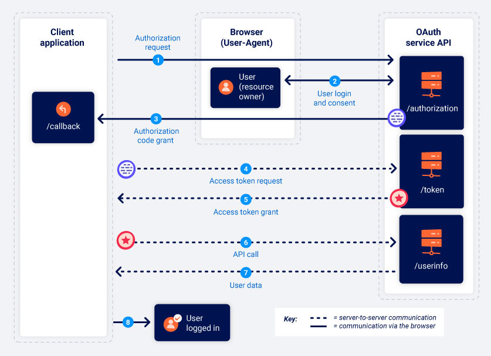
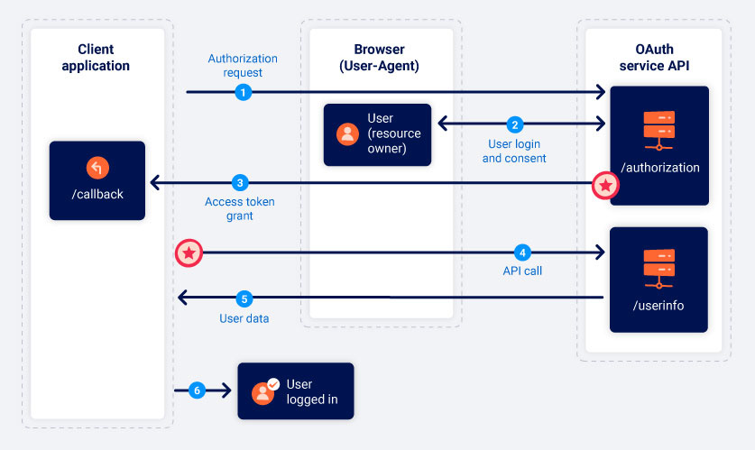

# OAuth (2.0)


## The OAuth 2.0 Flow

Note, step 3 onwards can vary depending on the authorization grant type (explained later):
1. Client requests access to a set of permissions of the user (resource owner's) data --> asks resource server.
2. If resource owner successfully authenticates with resource owner, resource server gives 'authorization grant' credential repsenting the resource owner's authorization.
3. Client uses authorization grant (which _can_ be the same as a resource server and also usually is loL) to pressure Authorization Server into giving it an access token.
4. Client uses access token to interact with permissions granted.


## Grant Types

### Authorization Code


The primary flow for this grant type is as follows:
1. Send authorization request from client, via resource owner browser (but not interactable with resource owner), to resource server.
2. Resource server prompts resource owner to authenticate on a separate server.
3. Upon success, resource server grants 'authorization code' grant to client, **but this alone is not valid for interactivity with resource server data**.
4. Exchange authorization code for access token from authorization server (which again could be the same as the resource server).
5. Access token can now be used for resource server data (resource grant) and subsequent client-user authentication.

### Implicit


Much simpler, but also more risky. Exchanging authorization code for access token (and refresh token) functionality is dropped; instead the resource server grants the access token immediately upon resource owner authentication.

All interactions occur via redirects through user-agent (browser). There is no direct secure connection between client and resource server.


### Request Structure

Authorization request:
```
GET /authorization?client_id=XXXX&redirect_uri=https://client.com/callback&response_type=code&scope=openid+profile&state=XXXXXXXXXXXXXXXX HTTP/1.1
Host: resource-server.com
```
*Note: `redirect_uri=token` instead if using implicit grant type - above is for authorization code grant.<br />
*Note: `state` functions as a CSRF token to ensure authorization request was not started as a result of CSRF.

